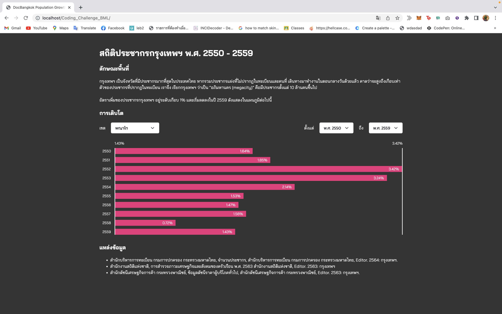

# Coding Challenge: Bangkok Population Growth in B.E. 2550 - 2559
- ในตอน generate ค่า chart ออกมา ในส่วนของ ค่าที่ติดลบ ยังทำได้ไม่เสร็จสมบูรณ์ สำหรับค่าที่ติดลบตอนนี้กำหนดค่าให้กราฟยาว 100% ไปก่อน 
- สามารถ select เลือกเขตได้เท่านั้น
- ยังไม่ได้ใส่ลิงค์เชื่อมไปยังแหล่งที่มา

# Preview

